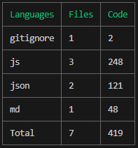

# CodeMeter

CodeMeter is a command-line tool that helps you analyze and calculate the number of lines and files in a project or given directory. It provides a detailed breakdown of the count of each file type and the total lines of code.

## Installation

```bash
npm install -g codemeter
```

## Usage

### Basic Usage

To analyze the current directory, simply run:

```bash
codemeter .
```

### Skip Directory

You can skip specific directories using the `--skip-dir` option. For example:

```bash
codemeter . --skip-dir node_modules
```

This command will exclude the `node_modules` directory from the analysis.

**Note:** Please provide the directory name without the "./" prefix. For example, use `folder_name` instead of `./folder_name/`.

### Defaults

If no arguments are provided, CodeMeter will default to analyzing the current directory:

```bash
codemeter
```

## Example

```bash
codemeter . --skip-dir node_modules .git
```



This command will analyze the current directory while skipping the `node_modules` and `.git` directory
